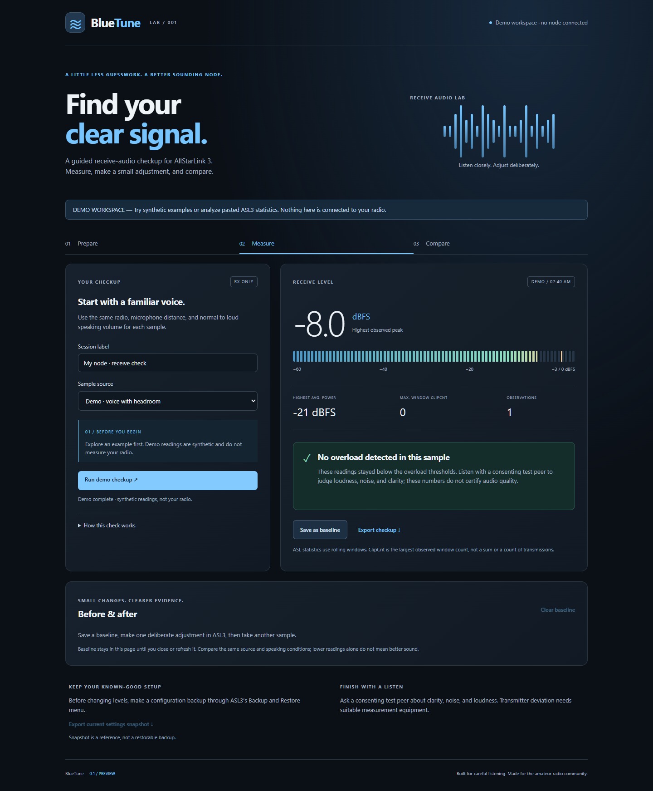

# BlueTune

Guided receive-audio checkups for AllStarLink 3. **0.1.2-preview**.

**First time here? Follow [Your first BlueTune checkup](docs/FIRST_CHECKUP.md).**
It covers the prerequisite check, live access, SSH tunnel, first sample, and removal.
See [readiness and remaining limits](docs/READINESS.md) for the tested scope.



BlueTune is a separate, Python-standard-library application in this folder. It
does not depend on BlueNode. No installation, Asterisk restart, audio capture,
transmit command, or tuning change is performed by BlueTune.

## Try it

Requires Git and Python 3.11 or newer:

```sh
git clone https://github.com/BlueKF0OZX/BlueTune.git
cd BlueTune
python3 start.py
```

Open **http://127.0.0.1:8091**. On Windows use `python start.py` if Python is
installed under that name (use `python start.py`). Stop with Ctrl+C.

The default workspace is explicitly **demo mode**, with synthetic examples for
headroom, overload, and very little input. You can also paste real ASL3
`RxAudioStats` lines. This does not verify their collection time or device.
Baseline and current results are held in page memory, and disappear on refresh.
Export a checkup to keep them. No microphone permission or Internet service is
needed by the app.

## Experimental live SimpleUSB adapter

Run on the ASL3 machine as your normal account. The launcher first tries direct
Asterisk access, then existing noninteractive sudo permission for three fixed
read-only commands. It does not install or broaden permissions. The web app
refuses to run as root. The fixed executable is `/usr/sbin/asterisk`.

1. In ASL3, select the intended SimpleUSB device. Close other tuning sessions.
2. Start BlueTune with its exact device/stanza name:

```sh
bash start.sh --check --device 1999
bash start.sh --live --device 1999
```

`1999` is an example; replace it with your device name. Omit `--device` to use
the active SimpleUSB device reported by ASL3. BlueTune checks that
the active name matches. It does not change the selected device itself.
Open the app, start a 10-second measurement, and speak into the node receiver
under appropriate test conditions. Confirm the speech checkbox. A failed or
canceled collection discards the partial sample.

BlueTune always listens on loopback. To view it from another computer, use an
SSH forward (replace the example account/host):

```sh
ssh -N -L 8091:127.0.0.1:8091 operator@your-node
```

Then open http://127.0.0.1:8091 on that computer. Phone layouts are supported,
but direct LAN hosting and remote authentication are not implemented yet.

The adapter runs only these literal commands:

- `asterisk -rx 'susb active'`
- `asterisk -rx 'susb tune menu-support Y'`
- `asterisk -rx 'susb show settings'` (only for a requested reference export)

When using existing sudo access, each command is prefixed with `/usr/bin/sudo -n --`.
No browser-supplied command is executed. `start.sh --check` collects a read-only
probe before reporting ready; quiet input is not a failed prerequisite check.

Unsupported output fails closed. USBRadio support is not implemented. Multiple
simultaneous tuning tools are not supported: the CLI's global device selection
cannot be made transactional by this adapter. Before/after checks detect many
selection changes but cannot exclude a change away and back between checks.
Statistics have no upstream timestamp, so a successful command does not prove
fresh audio frames; identical observations are not labeled a frozen stream.

## Interpreting results

- Unconfirmed speech is **unknown**, never a tuning pass.
- Any positive ClipCnt produces a clipping warning for a confirmed sample.
- Peak above −3 dBFS or any observed average power above −12 dBFS prompts a
  reduction in receive level, following ASL3's guidance.
- Peak below −40 dBFS is a conservative BlueTune heuristic for insufficient
  input, not an ASL calibration target. It never recommends raising gain.
- Otherwise the result is **no overload detected in this sample**, not a
  certification of loudness, intelligibility, RF deviation, or audio quality.
- ASL prints rolling-window statistics. BlueTune reports the maximum window
  ClipCnt, never sums overlapping windows. The average-power card shows the
  highest observed window average, not a session average.

Only compare the same source/device and speaking conditions. Demo and imported
results cannot be compared with live readings. Imports have no verified device
identity. Finish with a listening check using a consenting peer.

## Keep a restorable backup

Use **ASL3 Menu → Backup and Restore** before manually adjusting levels.
BlueTune's optional settings export is a human-readable reference only; it is
not a configuration backup and cannot restore the node. Automated tuning,
backup restoration, and TX measurement are outside this preview.

## Validation

```sh
python3 -m unittest discover -s tests -v
```

Unit/integration tests cover interpretation, malformed/unsupported observations,
device mismatch, command restrictions, timeouts, and HTTP access boundaries.
Browser tests in `tests/browser.cjs` use Playwright; pass the package location
with `PLAYWRIGHT_MODULE` if it is not on Node's normal module path. Start the
demo server on 8091, then run `node tests/browser.cjs`.
Set `BROWSER_CHANNEL=msedge` to use an installed Edge browser instead of
Playwright's bundled Chromium.

The 17 backend tests and browser checks passed on Windows, including narrow
phone layouts and simulated live success, failure, and cancellation.

On 2026-09-14, an operator-assisted receive session on one physical ASL3 node
returned 15 SimpleUSB observations through SSH. The active device matched before
and after collection. BlueTune's paste/import workflow accepted the output:
highest peak −7.0 dBFS, highest window-average power −29 dBFS, maximum ClipCnt 0.
This supports command/output compatibility and the import workflow on that node.
It does **not** validate the deployed live web adapter, audio quality, or other
hardware. The run included both voice and quiet observations; the highest peak
was not independently attributed to speech versus a key/unkey transient.

Required next checks: a listening comparison with a consenting operator,
deployment of the live adapter, actual device association, no-data/device-loss
behavior, observation freshness, and comparison with the ASL tuning display.

### First-user rehearsal (0.1.1 preview)

The candidate was copied into a fresh temporary folder on that existing ASL3
node, without installing a service or changing permissions/configuration. All
23 backend tests passed on Windows and on the node's Python 3.11.2. The startup
check detected the active SimpleUSB device through existing sudo permission;
a deliberately mismatched device was rejected.

The real live web adapter ran as the normal login account on loopback, through
an SSH tunnel using a different local port. A browser measurement completed
with nine actual quiet-input observations and remained inconclusive without
speech confirmation. Cancellation discarded a partial run. This supplements
the earlier voice/import check and verifies the basic live collection path on
one installation. It is **not** a clean-OS installation test or a live speech
quality test. Optional sudoers installation, other hardware/drivers/versions,
device loss and stale-audio detection still need separate checks. New users
should follow [the first-checkup guide](docs/FIRST_CHECKUP.md).

## Sources inspected 2026-09-14

- [ASL3 USB interface and voice-level guidance](https://allstarlink.github.io/adv-topics/usbinterfaces/)
- [ASL3 menu and backup support](https://allstarlink.github.io/user-guide/menu/)
- [SimpleUSB CLI implementation](https://github.com/AllStarLink/app_rpt/blob/491d9c0fcc236d54b75124917445e0d1209879c9/channels/chan_simpleusb.c): `susb_active`, `susb_tune`, `tune_menusupport`, uppercase `Y` one-shot branch.
- [Audio-statistics implementation](https://github.com/AllStarLink/app_rpt/blob/491d9c0fcc236d54b75124917445e0d1209879c9/res/res_usbradio.c): `ast_radio_check_audio`, `ast_radio_print_audio_stats`.

Local reference downloads under `research/` are ignored development material;
they are not part of the application. Threshold logic and UI are original.
